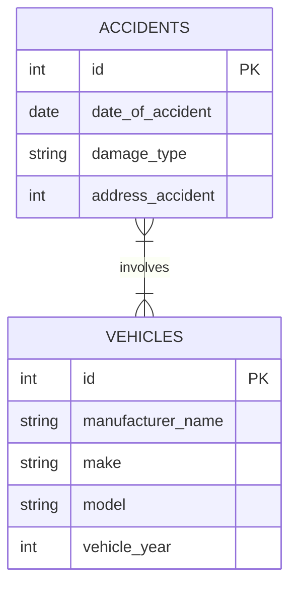

# AV Accident Analysis Web App

A Django web application for analyzing and tracking autonomous vehicle accident reports.

## Features

*   **Accident List & Filtering:** View all accidents with advanced filtering by Manufacturer, Damage Type, Date, and Zip Code.
*   **Dashboard:** Visual analytics including:
    *   Accidents by Damage Type (Pie Chart)
    *   Accidents Over Time (Bar Chart)
    *   Top 10 Manufacturers Involved (Horizontal Bar Chart)
*   **Data Entry:** User-friendly forms to report new accidents and register new vehicles with validation.
*   **Excel Export:** Export filtered accident data to `.xlsx` format.
*   **REST API:** Full API access to accident data with filtering capabilities.

## Database Schema

The following Entity Relationship Diagram (ERD) illustrates the data model:



## Prerequisites

- Python 3.8 or higher
- pip (Python package installer)

## Installation & Setup

1. **Clone the repository:**
   ```bash
   git clone https://github.com/sevval-dikkaya/accident-analysis-webapp.git
   cd accident-analysis-webapp
   ```

2. **Install dependencies:**
   ```bash
   pip install -r requirements.txt
   ```

3. **Apply database migrations:**
   This sets up the database structure (tables) on your local machine.
   ```bash
   python manage.py migrate
   ```

## Loading Sample Data

This project includes a sample dataset (`accidents_data.json`) containing accident records and vehicle information. To load this data into your local database:

```bash
python manage.py loaddata accidents_data.json
```

## Running the Application

1. **Start the development server:**
   ```bash
   python manage.py runserver
   ```

2. **Access the application:**
   Open your web browser and go to: [http://127.0.0.1:8000/](http://127.0.0.1:8000/)

## Docker Support

You can run the application using Docker Compose, which sets up the environment automatically.

1.  **Build and Run:**
    ```bash
    docker-compose up --build
    ```

2.  **Access the application:**
    The app will be available at [http://localhost:8000/](http://localhost:8000/).

## Testing

The project includes a test suite using `pytest`.

1.  **Run Tests:**
    ```bash
    pytest
    ```

    This will run all unit tests defined in `accident_analysis/tests.py`.

## API Usage

The application provides a REST API for accessing accident data.

*   **Base URL:** `/api/accidents/`
*   **Filtering Examples:**
    *   `?damage_type=major`
    *   `?manufacturer=Toyota`
    *   `?date_of_accident=2023-01-01`

## Admin Interface

To access the admin interface to manage accidents and vehicles:

1. **Create a superuser (if you haven't already):**
   ```bash
   python manage.py createsuperuser
   ```

2. **Go to the admin page:**
   [http://127.0.0.1:8000/admin/](http://127.0.0.1:8000/admin/)
